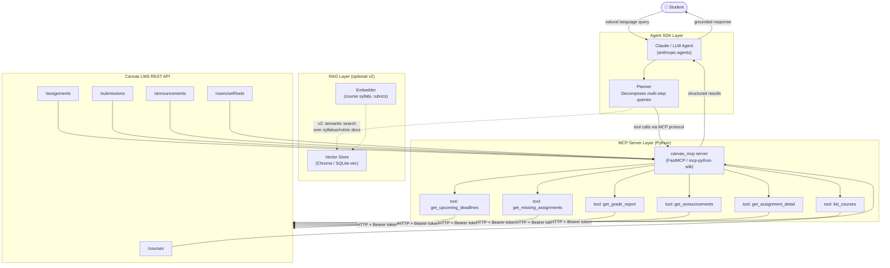

# Architecture Proposal: Canvas Academic Assistant

**Course:** ACS 4220 — AI Engineering  
**Project:** canvas-mcp — A Python MCP server + agentic assistant for Canvas LMS  
**Patterns Used:** MCP (Model Context Protocol) + Agent SDK  

---

## Problem Statement

Students waste time manually checking Canvas across multiple courses to piece together deadlines, grades, announcements, and missing work. There is no single conversational interface that lets a student ask "what do I need to do this week?" and get an accurate, cross-course answer grounded in live LMS data. This project solves that by building a Python-based MCP server that exposes Canvas LMS data as structured tools, and an agentic assistant that reasons across those tools to answer natural language academic queries.

---

## System Diagram



---

## Pattern 1: MCP (Model Context Protocol)

### Why this pattern fits

The core problem is **data access** — Canvas has a rich REST API but no natural language interface. MCP is the right pattern here because it decouples the data layer from the reasoning layer. The LLM doesn't scrape HTML or hallucinate deadlines; it calls typed tools that return structured data. This makes every response grounded and verifiable.

MCP also means the server is **reusable across clients** — Claude Desktop, a CLI, or a future web UI can all connect to the same server without changing the data layer.

### What data / services it connects to

| Tool | Canvas Endpoint | Returns |
|---|---|---|
| `list_courses` | `GET /courses` | Course names + IDs |
| `get_upcoming_deadlines` | `GET /courses/:id/assignments` | Sorted deadline list, configurable lookahead |
| `get_missing_assignments` | `GET /users/self/missing_submissions` | Unsubmitted past-due work |
| `get_grade_report` | `GET /courses?include[]=total_scores` | Current + final grades per course |
| `get_announcements` | `GET /announcements` | Recent instructor posts, keyword-filterable |
| `get_assignment_detail` | `GET /courses/:id/assignments/:id` | Full instructions + rubric criteria |

All calls are authenticated with a Canvas personal access token stored in `.env`. No OAuth flow required for single-user personal use.

### Risk / Limitation

**Canvas instance variability.** Canvas is a hosted product but each institution configures it differently. Some schools disable specific API endpoints (discussions, rubrics, file access) at the admin level. The `missing_submissions` endpoint in particular is known to return inconsistent results depending on how instructors configure assignment visibility. Mitigation: wrap every tool in graceful error handling that returns an informative message instead of crashing, and document which tools require instructor cooperation to work correctly.

---

## Pattern 2: Agent SDK

### Why this pattern fits

A single MCP tool call answers a narrow question. But most real student queries are **multi-step**: "What should I study this weekend?" requires fetching upcoming deadlines, checking grades to identify weak courses, and synthesizing a prioritized plan. That's an agentic workflow — the model needs to decide which tools to call, in what order, and how to combine results.

The Agent SDK (Anthropic `anthropic-agents` or equivalent) provides the planning and tool-orchestration loop without me having to hand-wire the decision logic. The agent decides: call `get_grade_report` first, identify the lowest grade, then call `get_upcoming_deadlines` for that course specifically, then generate a study plan. That emergent sequencing is what makes the assistant genuinely useful versus just a query wrapper.

### What data / services it connects to

The agent layer sits on top of the MCP server and has access to all its tools. For more complex queries it can:

- **Chain tools**: get courses → get assignments for each → rank by urgency + grade impact
- **Synthesize across tools**: combine grade data + upcoming deadlines to suggest priority order
- **Handle ambiguity**: if the user says "my AI class," the agent calls `list_courses` first to resolve the course ID before fetching assignments

The agent is stateless per session but can be given a system prompt with the student's name, current term, and any standing preferences (e.g., "I prioritize assignments worth 20%+ of my grade").

### Risk / Limitation

**Token cost and latency on fan-out queries.** A query like "give me a full status across all my courses" causes the agent to fan out — potentially calling `get_assignments` for 5+ courses sequentially before it can respond. Each tool call adds latency and burns tokens. Mitigation: the `getAllAssignments` helper in the MCP server already batches course fetches in parallel using `asyncio.gather`. The agent should be prompted to prefer the cross-course bulk tools over per-course calls when doing broad queries.

---

## Pattern 3: RAG (v2 / Bonus)

RAG is scoped to a v2 milestone. The core use case: students often want to ask questions about **syllabus content** — grading weights, late policies, project requirements — that live in uploaded PDF files, not in Canvas's structured API. A vector store (Chroma or `sqlite-vec`) seeded with course syllabi and rubric documents would let the agent answer "what's the late penalty in my databases course?" from grounded document context rather than hallucinating.

This is deferred to v2 because it requires a document ingestion pipeline and adds infrastructure complexity that isn't necessary for the MVP tools.

---

## Tech Stack

| Layer | Technology |
|---|---|
| MCP Server | Python 3.11+, `mcp` (Python SDK), `httpx` |
| Agent | `anthropic` Python SDK, tool-use loop |
| Canvas API | REST, Bearer token auth |
| Config | `python-dotenv`, `.env` file |
| Testing | `pytest`, `pytest-asyncio`, mocked Canvas responses |
| Runtime | stdio transport (Claude Desktop) or SSE (HTTP server mode) |

---

## Repo Structure

```
canvas-mcp/
├── canvas_mcp/
│   ├── __init__.py
│   ├── server.py          # MCP server entry point (FastMCP)
│   ├── canvas_client.py   # httpx wrapper for Canvas REST API
│   └── tools/
│       ├── assignments.py
│       ├── grades.py
│       └── announcements.py
├── agent/
│   └── assistant.py       # Agent SDK loop, system prompt, tool routing
├── tests/
│   ├── test_assignments.py
│   ├── test_grades.py
│   └── fixtures/          # Mocked Canvas API responses
├── .env.example
├── CLAUDE.md              # Project memory for Claude Code
├── proposal.md
├── architecture.md
└── README.md
```

---

## Acceptance Criteria (Spec with Teeth)

- [ ] `get_upcoming_deadlines(days=7)` returns correctly sorted results across ≥2 active courses
- [ ] `get_missing_assignments` returns only unsubmitted, past-due items (not excused)
- [ ] `get_grade_report` returns current score as a float; handles courses with no grades yet (returns `null`, not crash)
- [ ] Agent correctly resolves ambiguous course references (e.g., "my CS class") via `list_courses` before fetching
- [ ] All tools handle Canvas API errors (401, 404, 429) gracefully with descriptive messages
- [ ] Test suite covers happy path + error path for each tool using mocked HTTP responses
- [ ] Server starts in <2 seconds; individual tool calls complete in <3 seconds on a typical Canvas instance

---

## Milestones

| Week | Deliverable |
|---|---|
| 1 | MCP server with `list_courses`, `get_upcoming_deadlines`, `get_missing_assignments` |
| 2 | Add `get_grade_report`, `get_announcements`, `get_assignment_detail` + test suite |
| 3 | Agent SDK loop, system prompt, multi-step query handling |
| 4 | Polish, CLAUDE.md, README, presentation prep |
